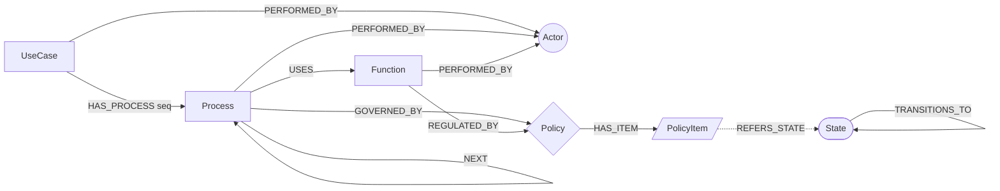

# 회원 온톨로지 구축 계획 (Property Graph / LPG)

> 소스: [member-ontology.md](member-ontology.md) — A커머스 회원가입·탈퇴 정책서 (Full v1.0)
> 표현: Neo4j Property Graph · 범위: 핵심 골격 · 목적: 설계참조 · 추론/검증 · 지식검색 · 데이터통합

---

## 1. 결정 사항 요약

| 항목 | 결정 |
|---|---|
| 표현 형식 | Labeled Property Graph (Neo4j 5.x / Cypher) |
| 범위 | 핵심 골격: 액터·유즈케이스·상태·프로세스·기능·정책. 용어·정책항목은 보조 레이어 |
| 목적 | ① 시스템 설계 표준 참조 ② 정책·상태 정합성 추론/검증 ③ 정책 Q&A/RAG 근거 ④ BSS·채널 데이터 통합 어휘 |
| 노드 키 | 소스 문서의 ID 체계 그대로 사용 (안정적 식별자 이미 존재) |

---

## 2. 소스 구조 → 그래프 매핑 (권위 출처)

소스의 **목록(가.) 절들이 ID 기반으로 동일한 PR-프로세스 헤딩을 공유** → 관계 추출 신뢰 출처. 상세표의 서술형 `관련 기능/정책` 필드는 명칭 표기가 달라 보조 근거로만 사용.

| 소스 절 | 제공 관계 | 키 |
|---|---|---|
| 3.가 액터 | `:Actor` 노드 | ACT-MBR-* |
| 3.나 유즈케이스 | `:UseCase` 노드 + `PERFORMED_BY` | US-MBR-* |
| 3.라.1 상태 코드 | `:State` 노드 | MBR_* |
| 3.라.2 상태 전이 기준 | `TRANSITIONS_TO` 관계 (event/condition/handler) | — |
| 4.가 프로세스 목록 | `:Process` 노드 + `(UseCase)-[HAS_PROCESS]->(Process)` | PR-MBR-* |
| 4.다 프로세스 상세 | Process 속성 (진입/종료조건, 액터) + `NEXT` (선행/후행) | — |
| 5.가 기능 목록 | `:Function` 노드 + `(Process)-[USES]->(Function)` ← **ID 기반** | FN-MBR-* |
| 5.나 기능 상세 | Function 속성 (입력/출력/상태-액션-결과/예외) | — |
| 6.가 정책 목록 | `:Policy` 노드 + `(Process)-[GOVERNED_BY]->(Policy)` ← **ID 기반** | PG-MBR-* |
| 6.나 정책 상세 | `:PolicyItem` 노드 + `(Policy)-[HAS_ITEM]->(PolicyItem)` + 값 | POL-MBR-* |
| 2. 용어 | `:Term` 보조 노드 (개념 사전) | TM-MBR-* |

**핵심**: Process↔Function, Process↔Policy 는 5.가·6.가의 ID 목록으로 연결 (서술명 매칭 불필요). 명칭 불일치 리스크 회피.

---

## 3. 그래프 스키마

### 3.1 노드 라벨

| 라벨 | 출처 | 건수(약) | 핵심 속성 |
|---|---|---|---|
| `:Actor` | ACT | 4 | id, name, desc |
| `:UseCase` | US | 11 | id, name, desc, isProcessDefined |
| `:State` | MBR_ | 8 | code, name, definition, followUp |
| `:Process` | PR | 22 | id, name, desc, actor, entryCond, exitCond, useCaseId, seq |
| `:Function` | FN | 29(고유) | id, name, desc, inputs[], outputs[], stateActions[], subFunctions[], exceptions[] |
| `:Policy` | PG | 44 | id, name, desc |
| `:PolicyItem` (보조) | POL | 476 | id, name, value, valueType, valueNum, valueUnit |
| `:Term` (보조) | TM | 41 | id, name, definition |

### 3.2 관계 타입

| 관계 | 시작 → 끝 | 속성 | 출처 |
|---|---|---|---|
| `PERFORMED_BY` | UseCase/Process/Function → Actor | — | 3.나 / 4.다 / 5.나 |
| `HAS_PROCESS` | UseCase → Process | seq | 4.가 |
| `NEXT` | Process → Process | — | 4.다 선행/후행 |
| `USES` | Process → Function | — | 5.가 (ID) |
| `GOVERNED_BY` | Process → Policy | — | 6.가 (ID) |
| `REGULATED_BY` | Function → Policy | — | 5.나 관련정책 (보조) |
| `HAS_ITEM` | Policy → PolicyItem | — | 6.나 |
| `TRANSITIONS_TO` | State → State | event, condition, handler, scope, triggerProcessId | 3.라.2 |
| `REFERS_STATE` (파생) | PolicyItem → State | — | 값에 상태코드 포함 시 |
| `ALIGNS` (파생) | Term → Actor/State | — | 동일 개념 정렬 |

### 3.3 스키마 다이어그램



---

## 4. 구축 단계

### Phase 0 — 스키마 확정 (산출: `schema.md`)
- 라벨·관계·속성키 동결. 제약·인덱스 정의.
```cypher
CREATE CONSTRAINT actor_id    FOR (n:Actor)      REQUIRE n.id   IS UNIQUE;
CREATE CONSTRAINT uc_id       FOR (n:UseCase)    REQUIRE n.id   IS UNIQUE;
CREATE CONSTRAINT proc_id     FOR (n:Process)    REQUIRE n.id   IS UNIQUE;
CREATE CONSTRAINT fn_id       FOR (n:Function)   REQUIRE n.id   IS UNIQUE;
CREATE CONSTRAINT pol_id      FOR (n:Policy)     REQUIRE n.id   IS UNIQUE;
CREATE CONSTRAINT polid_id    FOR (n:PolicyItem) REQUIRE n.id   IS UNIQUE;
CREATE CONSTRAINT state_code  FOR (n:State)      REQUIRE n.code IS UNIQUE;
CREATE CONSTRAINT term_id     FOR (n:Term)       REQUIRE n.id   IS UNIQUE;
```

### Phase 1 — 추출 (산출: `nodes/*.csv`, `rels/*.csv`)
- Python 파서가 member-ontology.md 표를 절 단위로 파싱 → 정규화 CSV.
- 멀티값 셀(`<br>` 구분)은 배열 속성 또는 관계 행으로 분리.
- 산출 CSV: `actors, usecases, states, processes, functions, policies, policy_items` + `rel_has_process, rel_uses, rel_governed_by, rel_has_item, rel_transitions, rel_next`.

### Phase 2 — 노드 적재
```cypher
LOAD CSV WITH HEADERS FROM 'file:///processes.csv' AS r
MERGE (p:Process {id: r.id})
SET p.name=r.name, p.desc=r.desc, p.actor=r.actor,
    p.entryCond=r.entryCond, p.exitCond=r.exitCond,
    p.useCaseId=r.useCaseId, p.seq=toInteger(r.seq);
```
(라벨별 반복)

### Phase 3 — 관계 적재 (ID 조인)
```cypher
LOAD CSV WITH HEADERS FROM 'file:///rel_uses.csv' AS r
MATCH (p:Process {id:r.processId}), (f:Function {id:r.functionId})
MERGE (p)-[:USES]->(f);
```

### Phase 4 — 전이·파생 강화
- 상태 전이: event/condition/handler 속성 적재. `전체 상태` 행은 `scope='ALL'` 메타 전이로 처리.
- 프로세스→전이 연결: 4.다 종료조건 ↔ 3.라.2 event 매핑표로 `triggerProcessId` 세팅 (예: 가입처리 → 미가입→정상).
- PolicyItem 값 타이핑: 정규식으로 숫자/단위 추출 (`7일`→valueNum=7,valueUnit=일; `6자리`→6). 추론·데이터통합 대비.
- 상태코드 포함 PolicyItem → `REFERS_STATE`.

### Phase 5 — 검증/추론 (산출: `validation.cypher`, 리포트)
무결성·정책 정합성 규칙 (§6).

### Phase 6 — 질의·Q&A 레이어 (산출: `queries.cypher`)
설계참조·RAG용 표준 질의 템플릿 (§7).

### Phase 7 — 데이터 통합 매핑 (산출: `integration-map.md`)
PolicyItem 값·Term ↔ BSS/채널 필드 정렬 (§8).

---

## 5. ID·명명 규칙

- 노드 키 = 소스 ID 그대로. `id` 변경 금지 (재적재 멱등성 `MERGE` 기준).
- 라벨 PascalCase, 관계 UPPER_SNAKE.
- 파생 노드/관계는 `source='derived'` 속성 태깅 → 원본과 구분.
- 속성명 camelCase.

---

## 6. 검증·추론 규칙 (추론/검증 목적)

```cypher
// R1. 액터 없는 프로세스
MATCH (p:Process) WHERE NOT (p)-[:PERFORMED_BY]->() RETURN p.id;

// R2. 정책 미적용 프로세스
MATCH (p:Process) WHERE NOT (p)-[:GOVERNED_BY]->() RETURN p.id;

// R3. 고립 정책 (어떤 프로세스도 참조 안 함)
MATCH (pol:Policy) WHERE NOT ()-[:GOVERNED_BY]->(pol) RETURN pol.id;

// R4. 미가입(MBR_NONE)에서 도달 불가 상태
MATCH (s:State) WHERE NOT (s)<-[:TRANSITIONS_TO*]-(:State {code:'MBR_NONE'})
  AND s.code<>'MBR_NONE' RETURN s.code;

// R5. 본인인증 프로세스인데 인증정책(PG-MBR-AUTH-*) 미연결
MATCH (p:Process) WHERE p.name CONTAINS '본인인증'
  AND NOT (p)-[:GOVERNED_BY]->(:Policy) WHERE (:Policy).id STARTS WITH 'PG-MBR-AUTH'
RETURN p.id;

// R6. 유예기간 정책 일관성 (TM 용어 7일 vs POL 값)
MATCH (pi:PolicyItem) WHERE pi.name CONTAINS '유예 기간'
RETURN pi.id, pi.value;  // 7일 단일값 기대
```

추론 활용: 고위험 업무(탈퇴) 인증 재사용 불가 규칙(PG-MBR-AUTH-008) ↔ 인증 적용정책(PG-MBR-AUTH-001) 충돌 탐지 등.

---

## 7. 질의·Q&A 예시 (설계참조·검색 목적)

```cypher
// Q1. 회원가입 전체 흐름 (순서 + 액터 + 정책)
MATCH (uc:UseCase {id:'US-MBR-CS-001'})-[h:HAS_PROCESS]->(p:Process)
OPTIONAL MATCH (p)-[:GOVERNED_BY]->(pol:Policy)
RETURN p.seq, p.name, p.actor, collect(pol.name) ORDER BY p.seq;

// Q2. 특정 기능이 쓰이는 모든 프로세스
MATCH (p:Process)-[:USES]->(f:Function {id:'FN-MBR-COM-002'}) RETURN p.id, p.name;

// Q3. "탈퇴 유예 기간은?" → 정책항목 직답 (RAG 근거)
MATCH (pi:PolicyItem) WHERE pi.name CONTAINS '유예 기간' RETURN pi.name, pi.value;

// Q4. 상태 전이 경로 (정상 → 탈퇴완료)
MATCH path=(:State {code:'MBR_ACTIVE'})-[:TRANSITIONS_TO*]->(:State {code:'MBR_WITHDRAWN'})
RETURN [n IN nodes(path)|n.code], [r IN relationships(path)|r.event];
```

RAG: 노드+1홉 이웃을 텍스트화 → 임베딩. 답변 시 ID 인용으로 근거 추적.

---

## 8. 데이터 통합 매핑 접근 (통합 목적)

- `:Term` 을 공통 어휘 사전으로 사용 (CI/DI/회원상태 등) → BSS·채널 필드 정렬 기준.
- PolicyItem 의 `상태 코드`, `결과 코드`, `인증수단` 등 열거값 → BSS 코드 테이블과 1:1 매핑표 작성.
- 매핑 산출: `integration-map.md` = {온톨로지 노드/속성 ↔ BSS 컬럼 ↔ 채널 필드}.

---

## 9. 도구·산출물

| 구분 | 선택 |
|---|---|
| 그래프 DB | Neo4j 5.x + APOC |
| 추출 | Python (md 표 파서, 기존 변환 스크립트 재활용) |
| 적재 | `LOAD CSV` 또는 `neo4j-admin import` |
| (선택) OWL 내보내기 | neosemantics(n10s) — 추후 정식 온톨로지 필요 시 |
| 빠른 PoC 대안 | `/graphify` 스킬로 즉시 KG 시각화 후 스키마 검증 |

**산출물**: schema.md · 추출 CSV 세트 · load.cypher · validation.cypher · queries.cypher · integration-map.md · KG 시각화.

---

## 10. 리스크·주의

| 리스크 | 대응 |
|---|---|
| 상세표 `관련 정책` 서술명 ≠ PG 정식명 | 관계는 6.가 ID 목록을 권위 출처로. 서술명은 무시 또는 별도 `mentions` 보조관계 |
| 동일 FN/PG 가 여러 프로세스에서 재사용 | 노드 1개 + 관계 N개 (MERGE 로 중복 방지) |
| PolicyItem 476건 → 그래프 비대 | 보조 레이어로 분리. 핵심 질의는 Process/Policy 층에서. 필요 시 서브그래프 적재 |
| `전체 상태` 전이 (메타 규칙) | 일반 전이와 구분 위해 `scope='ALL'` 태깅 |
| 정책 값 자유텍스트 | Phase 4 타이핑으로 숫자/열거값 구조화, 원문은 `value` 보존 |

---

## 11. 권장 진행 순서

1. Phase 0~1 먼저 (스키마+추출 CSV) → 적재 전 데이터 검토.
2. 소규모 검증: 회원가입(US-MBR-CS-001) 서브그래프만 적재 → §7 Q1 확인.
3. 전체 적재 → §6 검증 규칙 일괄 실행 → 리포트.
4. 데이터 통합 매핑은 BSS 스키마 확보 후 착수.
