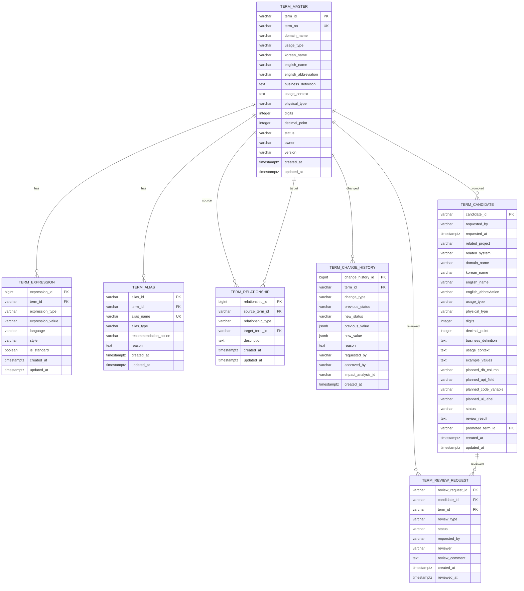

# 데이터 사전 코어 ERD

```mermaid
erDiagram
    TERM_MASTER {
        varchar term_id PK
        varchar term_no UK
        varchar domain_name
        varchar usage_type
        varchar korean_name
        varchar english_name
        varchar english_abbreviation
        text business_definition
        text usage_context
        varchar physical_type
        integer digits
        integer decimal_point
        varchar status
        varchar owner
        varchar version
        timestamptz created_at
        timestamptz updated_at
    }

    TERM_EXPRESSION {
        bigint expression_id PK
        varchar term_id FK
        varchar expression_type
        varchar expression_value
        varchar language
        varchar style
        boolean is_standard
        timestamptz created_at
        timestamptz updated_at
    }

    TERM_ALIAS {
        varchar alias_id PK
        varchar term_id FK
        varchar alias_name UK
        varchar alias_type
        varchar recommendation_action
        text reason
        timestamptz created_at
        timestamptz updated_at
    }

    TERM_RELATIONSHIP {
        bigint relationship_id PK
        varchar source_term_id FK
        varchar relationship_type
        varchar target_term_id FK
        text description
        timestamptz created_at
        timestamptz updated_at
    }

    TERM_CHANGE_HISTORY {
        bigint change_history_id PK
        varchar term_id FK
        varchar change_type
        varchar previous_status
        varchar new_status
        jsonb previous_value
        jsonb new_value
        text reason
        varchar requested_by
        varchar approved_by
        varchar impact_analysis_id
        timestamptz created_at
    }

    TERM_CANDIDATE {
        varchar candidate_id PK
        varchar requested_by
        timestamptz requested_at
        varchar related_project
        varchar related_system
        varchar domain_name
        varchar korean_name
        varchar english_name
        varchar english_abbreviation
        varchar usage_type
        varchar physical_type
        integer digits
        integer decimal_point
        text business_definition
        text usage_context
        text example_values
        varchar planned_db_column
        varchar planned_api_field
        varchar planned_code_variable
        varchar planned_ui_label
        varchar status
        text review_result
        varchar promoted_term_id FK
        timestamptz created_at
        timestamptz updated_at
    }

    TERM_REVIEW_REQUEST {
        varchar review_request_id PK
        varchar candidate_id FK
        varchar term_id FK
        varchar review_type
        varchar status
        varchar requested_by
        varchar reviewer
        text review_comment
        timestamptz created_at
        timestamptz reviewed_at
    }

    TERM_MASTER ||--o{ TERM_EXPRESSION : has
    TERM_MASTER ||--o{ TERM_ALIAS : has
    TERM_MASTER ||--o{ TERM_RELATIONSHIP : source
    TERM_MASTER ||--o{ TERM_RELATIONSHIP : target
    TERM_MASTER ||--o{ TERM_CHANGE_HISTORY : changed
    TERM_MASTER ||--o{ TERM_CANDIDATE : promoted
    TERM_MASTER ||--o{ TERM_REVIEW_REQUEST : reviewed
    TERM_CANDIDATE ||--o{ TERM_REVIEW_REQUEST : reviewed
```

