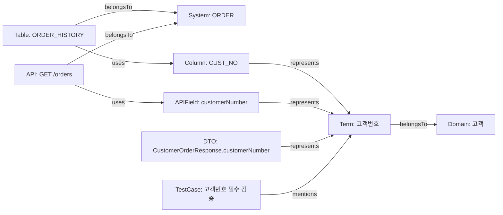

# Graphify 그래프 모델 설계

## 1. 목적

본 문서는 용어 관계 검색과 변경 영향도 분석을 위해 Graphify에 적재할 그래프 노드, 관계, 방향, 속성, 동기화 정책을 정의한다.

그래프 모델의 핵심 목표는 다음 질문에 답하는 것이다.

- 고객번호와 연결된 DB 컬럼, API 필드, 코드 변수는 무엇인가?
- `CUST_NO`를 사용하는 시스템, 테이블, API, DTO, 테스트는 무엇인가?
- 표준 용어를 변경하면 어떤 산출물이 영향받는가?
- 폐기 용어 또는 금지 표현이 아직 어디에서 사용되는가?

## 2. 설계 원칙

| 원칙 | 설명 |
|---|---|
| 표준 용어 중심 | `Term` 노드를 의미의 기준점으로 둔다. |
| 산출물 분리 | DB, API, 코드, 문서, 테스트 산출물을 별도 노드로 둔다. |
| 방향 명시 | 영향도 분석이 가능하도록 관계 방향을 고정한다. |
| 출처 추적 | 모든 노드와 관계에 원천 시스템, 파일, sync key를 기록한다. |
| 폐기 보존 | 삭제 또는 폐기된 데이터는 즉시 제거하지 않고 상태와 대체 관계를 보존한다. |

## 3. 노드 정의

| 노드 | 설명 | 고유 키 | 주요 속성 |
|---|---|---|---|
| `Term` | 표준 업무 용어 | `term:{termId}` | `termId`, `koreanName`, `englishName`, `englishAbbreviation`, `status`, `domainName`, `version` |
| `Domain` | 업무 도메인 | `domain:{domainName}` | `domainName`, `owner`, `description` |
| `System` | 업무/기술 시스템 | `system:{systemCode}` | `systemCode`, `systemName`, `owner`, `lifecycleStatus` |
| `Table` | DB 테이블 | `table:{systemCode}.{schemaName}.{tableName}` | `systemCode`, `schemaName`, `tableName`, `description` |
| `Column` | DB 컬럼 | `column:{systemCode}.{schemaName}.{tableName}.{columnName}` | `columnName`, `physicalType`, `digits`, `decimalPoint`, `nullable` |
| `API` | API 엔드포인트 | `api:{systemCode}.{method}.{path}` | `method`, `path`, `operationId`, `version`, `status` |
| `APIField` | API 요청/응답 필드 | `apiField:{systemCode}.{operationId}.{fieldPath}` | `fieldName`, `fieldPath`, `direction`, `schemaType`, `required` |
| `DTO` | DTO 클래스 | `dto:{systemCode}.{packageName}.{className}` | `packageName`, `className`, `language`, `artifactPath` |
| `Entity` | Entity 클래스 | `entity:{systemCode}.{packageName}.{className}` | `packageName`, `className`, `tableName`, `artifactPath` |
| `Document` | 기획서, 설계서, API 문서 | `document:{repository}.{path}` | `path`, `title`, `documentType`, `version` |
| `TestCase` | 테스트 케이스 | `testCase:{repository}.{path}.{testName}` | `path`, `testName`, `framework`, `scenario` |

## 4. 관계 정의

| 관계 | 방향 | 의미 | 주요 속성 |
|---|---|---|---|
| `belongsTo` | `Term -> Domain` | 용어가 도메인에 속함 | `source`, `syncedAt` |
| `belongsTo` | `System -> Domain` | 시스템이 도메인에 속함 | `source`, `confidence` |
| `belongsTo` | `Table -> System` | 테이블이 시스템에 속함 | `schemaName`, `syncedAt` |
| `belongsTo` | `API -> System` | API가 시스템에 속함 | `apiVersion`, `syncedAt` |
| `belongsTo` | `DTO -> System` | DTO가 시스템에 속함 | `repository`, `artifactPath` |
| `belongsTo` | `Entity -> System` | Entity가 시스템에 속함 | `repository`, `artifactPath` |
| `represents` | `Column -> Term` | DB 컬럼이 표준 용어를 표현함 | `expressionType=DB_COLUMN`, `expressionValue`, `confidence` |
| `represents` | `APIField -> Term` | API 필드가 표준 용어를 표현함 | `expressionType=API_FIELD`, `expressionValue`, `direction` |
| `represents` | `DTO -> Term` | DTO 속성이 표준 용어를 표현함 | `fieldName`, `language` |
| `represents` | `Entity -> Term` | Entity 속성이 표준 용어를 표현함 | `fieldName`, `language` |
| `mentions` | `Document -> Term` | 문서가 표준 용어를 언급함 | `matchedText`, `section`, `line` |
| `mentions` | `TestCase -> Term` | 테스트가 표준 용어를 언급함 | `matchedText`, `scenarioStep` |
| `uses` | `API -> APIField` | API가 필드를 사용함 | `direction`, `required` |
| `uses` | `Table -> Column` | 테이블이 컬럼을 포함/사용함 | `ordinalPosition`, `nullable` |
| `uses` | `DTO -> APIField` | DTO 속성이 API 필드로 사용됨 | `fieldName`, `direction` |
| `uses` | `Entity -> Column` | Entity 속성이 DB 컬럼으로 매핑됨 | `fieldName`, `mappingAnnotation` |
| `uses` | `TestCase -> API` | 테스트가 API를 검증함 | `testType`, `scenario` |
| `deprecatedBy` | `Term -> Term` | 폐기 용어가 대체 표준 용어로 대체됨 | `reason`, `deprecatedAt`, `approvedBy` |

## 5. 관계 방향 기준

| 분석 목적 | 탐색 방향 |
|---|---|
| 용어 영향도 분석 | `Term <- represents <- Column/APIField/DTO/Entity <- uses <- API/Table/TestCase` |
| 산출물 표준 용어 확인 | `Artifact -> represents -> Term` |
| 시스템별 사용 현황 | `System <- belongsTo <- API/Table/DTO/Entity -> uses/represents -> Term` |
| 폐기 용어 대체 추적 | `Deprecated Term -> deprecatedBy -> Replacement Term` |
| 문서 용어 검토 | `Document -> mentions -> Term` |

## 6. 노드 속성 공통 규칙

모든 노드는 다음 공통 속성을 가진다.

| 속성 | 설명 |
|---|---|
| `nodeKey` | 노드 고유 키 |
| `nodeType` | `Term`, `Column`, `APIField` 등 노드 유형 |
| `sourceType` | `DATA_DICTIONARY`, `DB_METADATA`, `OPENAPI`, `CODE`, `DOCUMENT`, `TEST` |
| `sourceRef` | 원천 파일, 테이블, API 명세 위치 |
| `syncKey` | 증분 동기화 기준 키 |
| `checksum` | 원천 내용 checksum |
| `status` | `Active`, `Deprecated`, `Deleted`, `Unknown` |
| `createdAt` | 그래프 최초 생성 시각 |
| `updatedAt` | 마지막 동기화 시각 |

## 7. 관계 속성 공통 규칙

모든 관계는 다음 공통 속성을 가진다.

| 속성 | 설명 |
|---|---|
| `edgeKey` | 관계 고유 키 |
| `relationshipType` | `represents`, `mentions`, `uses`, `belongsTo`, `deprecatedBy` |
| `sourceType` | 관계 추출 출처 |
| `sourceRef` | 원천 위치 |
| `confidence` | 추출 신뢰도. 수동/사전 매핑은 `1.0` |
| `evidence` | 관계 판단 근거 |
| `syncKey` | 관계 동기화 기준 키 |
| `checksum` | 관계 원천 checksum |
| `status` | `Active`, `Deprecated`, `Deleted`, `Ambiguous` |
| `createdAt` | 최초 생성 시각 |
| `updatedAt` | 마지막 동기화 시각 |

## 8. 동기화 키

| 대상 | sync key |
|---|---|
| `Term` | `TERM_MASTER:{termId}:{version}` |
| `Domain` | `DOMAIN:{domainName}` |
| `System` | `SYSTEM:{systemCode}` |
| `Table` | `DB:{systemCode}:{schemaName}:{tableName}` |
| `Column` | `DB:{systemCode}:{schemaName}:{tableName}:{columnName}` |
| `API` | `OPENAPI:{systemCode}:{method}:{path}:{operationId}` |
| `APIField` | `OPENAPI:{systemCode}:{operationId}:{direction}:{fieldPath}` |
| `DTO` | `CODE:{repository}:{packageName}:{className}` |
| `Entity` | `CODE:{repository}:{packageName}:{className}` |
| `Document` | `DOC:{repository}:{path}:{version}` |
| `TestCase` | `TEST:{repository}:{path}:{testName}` |
| `represents` | `REPRESENTS:{fromNodeKey}:{termId}` |
| `mentions` | `MENTIONS:{fromNodeKey}:{termId}:{location}` |
| `uses` | `USES:{fromNodeKey}:{toNodeKey}` |
| `belongsTo` | `BELONGS_TO:{fromNodeKey}:{toNodeKey}` |
| `deprecatedBy` | `DEPRECATED_BY:{deprecatedTermId}:{replacementTermId}` |

## 9. 동기화 정책

| 원천 | 동기화 방식 | 기준 |
|---|---|---|
| 데이터 사전 | 이벤트 또는 주기 동기화 | `term_master`, `term_expression`, `term_alias`, `term_relationship` 변경 |
| DB 메타데이터 | 주기 동기화 | table/column metadata checksum |
| OpenAPI | PR 또는 CI 동기화 | OpenAPI YAML checksum |
| 코드 | PR 또는 main branch 동기화 | DTO/Entity 파일 checksum |
| 문서 | 문서 저장/업로드 시 동기화 | 문서 path + version |
| 테스트 | PR 또는 CI 동기화 | 테스트 파일 checksum |

동기화 처리 순서는 다음과 같다.

1. 원천 데이터에서 node/edge 후보를 추출한다.
2. `syncKey`로 기존 그래프 요소를 조회한다.
3. 없으면 생성한다.
4. 있으면 checksum을 비교한다.
5. checksum이 다르면 속성과 `updatedAt`을 갱신한다.
6. 원천에서 사라진 요소는 즉시 삭제하지 않고 `Deleted` 상태로 전환한다.

## 10. 삭제와 폐기 정책

| 상황 | 처리 |
|---|---|
| 표준 용어 Deprecated | `Term.status=Deprecated`로 유지하고 `deprecatedBy` 관계를 생성한다. |
| 표준 용어 Rejected | `Term.status=Rejected`로 유지하고 신규 추천 대상에서 제외한다. |
| DB 컬럼 삭제 | `Column.status=Deleted`, 관련 `uses`, `represents` 관계도 `Deleted` 처리한다. |
| API 필드 삭제 | `APIField.status=Deleted`, 관련 `uses`, `represents` 관계도 `Deleted` 처리한다. |
| 코드 속성 삭제 | `DTO`/`Entity`의 해당 field-level 관계를 `Deleted` 처리한다. |
| 문서 언급 제거 | `mentions.status=Deleted`로 변경한다. |
| 테스트 삭제 | `TestCase.status=Deleted`, API/Term 연결 관계도 `Deleted` 처리한다. |

## 11. 고객번호 연결 예시

### 11.1 노드

| nodeKey | nodeType | 주요 속성 |
|---|---|---|
| `term:T-000001` | `Term` | `koreanName=고객번호`, `englishAbbreviation=CUST_NO`, `status=Approved` |
| `domain:고객` | `Domain` | `domainName=고객` |
| `system:ORDER` | `System` | `systemName=Order` |
| `table:ORDER.public.ORDER_HISTORY` | `Table` | `tableName=ORDER_HISTORY` |
| `column:ORDER.public.ORDER_HISTORY.CUST_NO` | `Column` | `columnName=CUST_NO`, `physicalType=VARCHAR`, `digits=20` |
| `api:ORDER.GET./orders` | `API` | `method=GET`, `path=/orders`, `operationId=searchOrders` |
| `apiField:ORDER.searchOrders.query.customerNumber` | `APIField` | `fieldName=customerNumber`, `direction=query` |
| `dto:ORDER.com.aulms.order.CustomerOrderResponse` | `DTO` | `className=CustomerOrderResponse` |
| `testCase:ORDER.CustomerOrderApiTest.customerNumberRequired` | `TestCase` | `testName=customerNumberRequired` |

### 11.2 관계

| from | relationship | to |
|---|---|---|
| `term:T-000001` | `belongsTo` | `domain:고객` |
| `table:ORDER.public.ORDER_HISTORY` | `belongsTo` | `system:ORDER` |
| `column:ORDER.public.ORDER_HISTORY.CUST_NO` | `represents` | `term:T-000001` |
| `apiField:ORDER.searchOrders.query.customerNumber` | `represents` | `term:T-000001` |
| `api:ORDER.GET./orders` | `uses` | `apiField:ORDER.searchOrders.query.customerNumber` |
| `table:ORDER.public.ORDER_HISTORY` | `uses` | `column:ORDER.public.ORDER_HISTORY.CUST_NO` |
| `dto:ORDER.com.aulms.order.CustomerOrderResponse` | `represents` | `term:T-000001` |
| `testCase:ORDER.CustomerOrderApiTest.customerNumberRequired` | `mentions` | `term:T-000001` |

이 모델이면 `고객번호`에서 출발해 `CUST_NO`, `customerNumber`, `/orders` API, DTO, 테스트 케이스를 모두 추적할 수 있다.

## 12. Mermaid 예시



## 13. Graphify 적재 단위

MVP4에서는 다음 단위로 Graphify JSON을 생성한다.

| 입력 | 생성 노드 | 생성 관계 |
|---|---|---|
| `term_master` | `Term`, `Domain` | `Term belongsTo Domain` |
| `term_expression` | `Column`, `APIField` 후보 | `Column/APIField represents Term` |
| OpenAPI spec | `API`, `APIField` | `API uses APIField`, `APIField represents Term` |
| DB metadata | `System`, `Table`, `Column` | `Table belongsTo System`, `Table uses Column`, `Column represents Term` |
| DTO/Entity scan | `DTO`, `Entity` | `DTO/Entity represents Term`, `Entity uses Column` |
| 기획서/테스트 scan | `Document`, `TestCase` | `Document/TestCase mentions Term` |

## 14. 완료 기준 확인

`고객번호`, `CUST_NO`, `customerNumber`, 관련 API 필드는 다음 방식으로 연결된다.

```text
Column(CUST_NO) -> represents -> Term(고객번호)
APIField(customerNumber) -> represents -> Term(고객번호)
API(GET /orders) -> uses -> APIField(customerNumber)
Table(ORDER_HISTORY) -> uses -> Column(CUST_NO)
```

따라서 `Term(고객번호)` 기준 영향도 탐색과 `CUST_NO` 기준 역방향 추적이 모두 가능하다.
