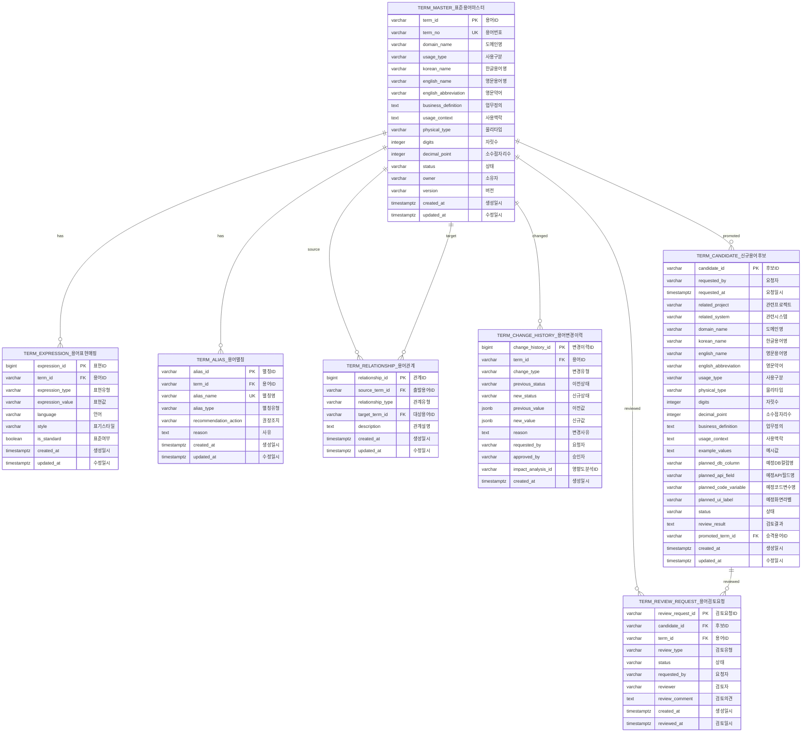
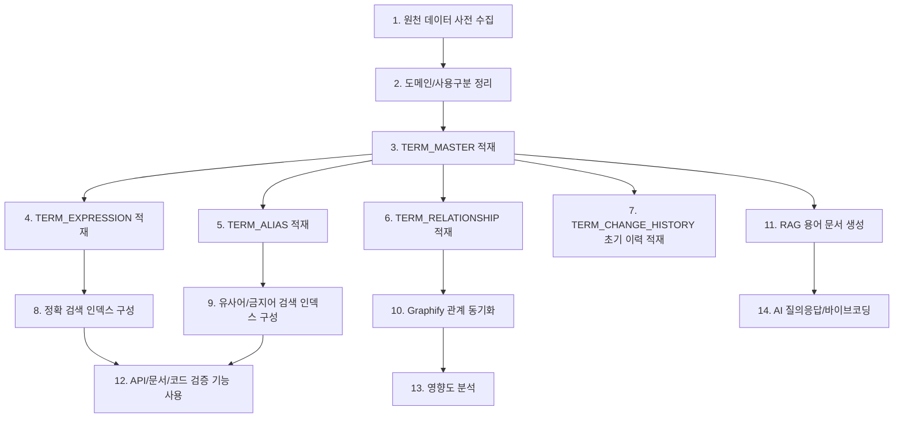
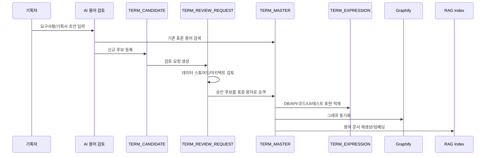
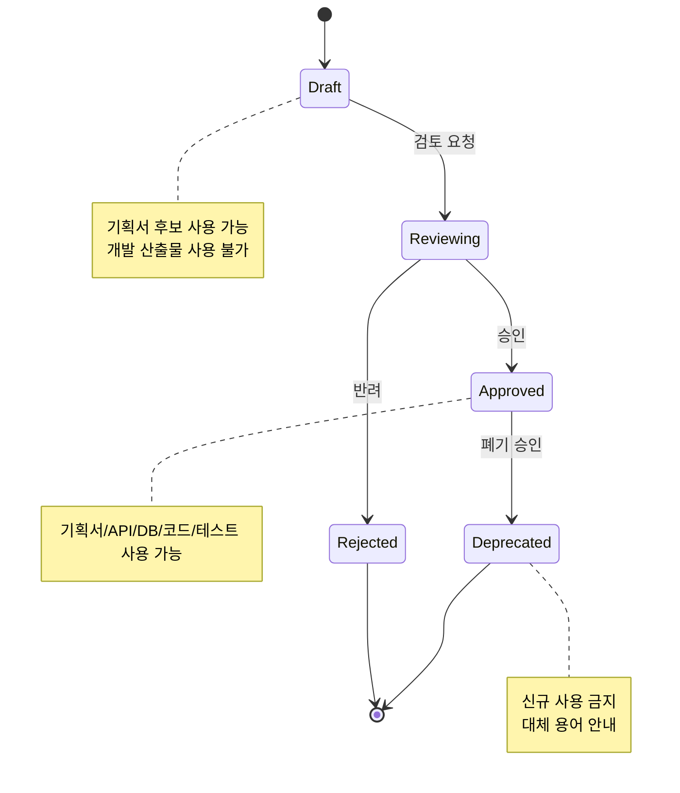
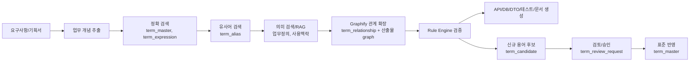
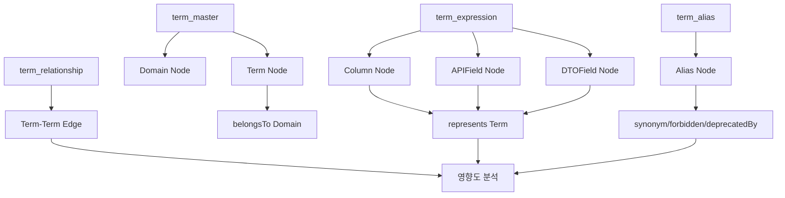
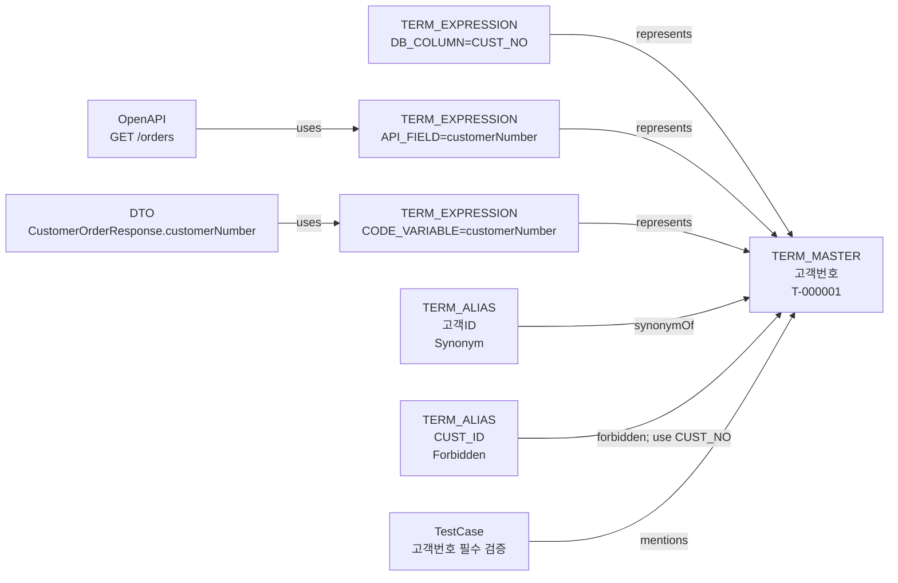

# 유비쿼터스 랭기지 저장 모델 종합 장표

## 1. 목적

본 문서는 지금까지 정의한 데이터 사전 기반 유비쿼터스 랭기지 저장 테이블의 ERD, 적재 순서, 운영 흐름, AI/RAG/Graphify 활용 방안을 하나로 정리한다.

핵심 목표는 다음과 같다.

- 기획 용어, DB 컬럼, API 필드, 코드 변수, 테스트 용어를 하나의 표준 의미 체계로 연결한다.
- 승인된 표준 용어만 개발 산출물에 사용한다.
- 신규 용어는 후보, 검토, 승인, 승격 흐름으로 관리한다.
- AI와 바이브코딩은 데이터 사전, RAG, Graphify를 참조해 임의 명명 생성을 줄인다.

## 2. 테이블 그룹

| 그룹 | 테이블 | 역할 |
|---|---|---|
| 표준 용어 | `term_master` | 표준 용어의 중심 정보 |
| 표현 매핑 | `term_expression` | 한글명, 영문명, DB 컬럼, API 필드, 코드 변수, UI 라벨, 테스트 용어 매핑 |
| 별칭/금지어 | `term_alias` | 유사어, 금지어, 폐기어, 문맥 확인 표현 |
| 용어 관계 | `term_relationship` | 용어 간 `usedWith`, `relatedTo`, `deprecatedBy` 등 관계 |
| 변경 이력 | `term_change_history` | 용어 등록, 수정, 승인, 폐기 이력 |
| 후보 관리 | `term_candidate` | 신규 용어 후보 |
| 검토 관리 | `term_review_request` | 후보 또는 용어 변경 검토 |
| 프롬프트 관리 | `prompt_template`, `prompt_template_version`, `prompt_template_history` | AI/바이브코딩 프롬프트 템플릿 관리 권장 테이블 |
| Graphify 동기화 | `graph_sync_log` | 그래프 동기화 실행 로그 권장 테이블 |

## 3. Core ERD



## 4. 권장 확장 ERD

프롬프트 템플릿과 Graphify 동기화 로그는 MVP3/MVP4에서 인메모리로 구현되어 있으나, 운영 DB에서는 아래 구조로 분리하는 것을 권장한다.

```mermaid
erDiagram
    PROMPT_TEMPLATE_프롬프트템플릿 {
        varchar template_id PK "템플릿ID"
        varchar template_type "템플릿유형"
        varchar name "템플릿명"
        varchar version "버전"
        varchar status "상태"
        text description "설명"
        text body "본문"
        text version_policy "버전정책"
        timestamptz created_at "생성일시"
        timestamptz updated_at "수정일시"
    }

    PROMPT_TEMPLATE_VARIABLE_프롬프트변수 {
        bigint variable_id PK "변수ID"
        varchar template_id FK "템플릿ID"
        varchar variable_name "변수명"
        text description "설명"
        boolean required "필수여부"
        varchar source "출처"
        timestamptz created_at "생성일시"
    }

    PROMPT_TEMPLATE_VERSION_프롬프트버전 {
        bigint version_id PK "버전ID"
        varchar template_id FK "템플릿ID"
        varchar version "버전"
        varchar status "상태"
        text body "본문"
        text change_reason "변경사유"
        varchar created_by "생성자"
        timestamptz created_at "생성일시"
    }

    PROMPT_TEMPLATE_HISTORY_프롬프트변경이력 {
        bigint history_id PK "이력ID"
        varchar template_id FK "템플릿ID"
        varchar version "버전"
        varchar change_type "변경유형"
        text reason "사유"
        varchar actor "행위자"
        timestamptz created_at "생성일시"
    }

    GRAPH_SYNC_LOG_그래프동기화로그 {
        bigint log_id PK "로그ID"
        varchar mode "동기화모드"
        boolean success "성공여부"
        integer created_nodes "생성노드수"
        integer updated_nodes "수정노드수"
        integer created_edges "생성엣지수"
        integer updated_edges "수정엣지수"
        integer skipped_items "건너뜀항목수"
        integer retry_count "재시도수"
        text message "메시지"
        timestamptz created_at "생성일시"
    }

    PROMPT_TEMPLATE_프롬프트템플릿 ||--o{ PROMPT_TEMPLATE_VARIABLE_프롬프트변수 : has
    PROMPT_TEMPLATE_프롬프트템플릿 ||--o{ PROMPT_TEMPLATE_VERSION_프롬프트버전 : versions
    PROMPT_TEMPLATE_프롬프트템플릿 ||--o{ PROMPT_TEMPLATE_HISTORY_프롬프트변경이력 : changed
```



## 5. 적재 순서



## 6. 신규 용어 승인 적재 흐름



## 7. 상태 전이



## 8. 핵심 테이블 활용 방안

| 활용 영역 | 사용하는 테이블 | 방식 |
|---|---|---|
| 정확 검색 | `term_master`, `term_expression` | 한글명, 영문명, DB 컬럼, API 필드, 코드 변수 exact match |
| 유사어 검색 | `term_alias`, `term_master` | 고객ID, customerId, CUST_ID를 고객번호로 변환 또는 금지 경고 |
| 의미 검색/RAG | `term_master`, `term_expression`, `term_alias` | 업무 정의, 사용 맥락, 예시 문장을 문서화해 임베딩 검색 |
| 관계 검색 | `term_relationship` | 관련 용어, 함께 쓰는 용어, 대체 용어 탐색 |
| 기획서 검토 | `term_master`, `term_alias`, `term_candidate` | 비표준 표현 탐지, 표준 용어 추천, 신규 후보 분리 |
| 바이브코딩 | `term_master`, `term_expression`, `prompt_template` | DTO/API/SQL 생성 시 표준 표현 주입 |
| PR/CI 검증 | `term_expression`, `term_alias`, `term_change_history` | DDL, OpenAPI, 코드 변수, 테스트 용어 검증 |
| 영향도 분석 | `term_relationship`, Graphify graph | 용어 변경 시 DB/API/DTO/문서/테스트 영향 추적 |
| 운영 감사 | `term_change_history`, `term_review_request`, `graph_sync_log` | 승인/폐기/동기화 이력 추적 |

## 9. AI/RAG/Graphify 활용 구조



## 10. Graphify 동기화 구조



## 11. 고객번호 예시



## 12. 데이터 품질 규칙

| 규칙 | 설명 |
|---|---|
| 표준 용어 중복 금지 | `korean_name`, `english_abbreviation` 중복 검토 |
| 표현값 중복 금지 | `expression_type`, `expression_value` 조합 unique |
| 별칭 중복 금지 | `alias_name` unique |
| 자기 관계 금지 | `source_term_id <> target_term_id` |
| Approved만 개발 사용 | Draft/Reviewing은 개발 산출물 사용 불가 |
| Deprecated 사용 금지 | 대체 용어를 `deprecatedBy` 또는 별칭 reason으로 안내 |
| 물리 스펙 검증 | `physical_type`, `digits`, `decimal_point` 불일치 검출 |
| 변경 이력 필수 | 승인, 폐기, 주요 수정은 `term_change_history` 기록 |

## 13. 운영 활용 시나리오

### 13.1 기획서 표준화

```text
입력: 고객 ID를 입력하면 주문 리스트를 조회한다.
검색: term_alias.고객ID -> term_master.고객번호
검색: term_alias.주문 리스트 -> term_master.주문목록
출력: 고객번호를 입력하면 주문목록을 조회한다.
```

### 13.2 바이브코딩 산출물 생성

```text
입력: 고객별 주문 내역 조회 API 만들어줘.
매핑: 고객번호, 주문번호, 주문일자, 주문금액, 주문상태코드
생성: OpenAPI Schema, DTO, SQL
검증: API 필드명과 DB 컬럼명이 term_expression 표준과 일치하는지 확인
```

### 13.3 영향도 분석

```text
질문: CUST_NO를 customerNumber로 노출하는 API는?
Graphify:
Column(CUST_NO) -> represents -> Term(고객번호)
APIField(customerNumber) -> represents -> Term(고객번호)
API(GET /orders) -> uses -> APIField(customerNumber)
```

## 14. 구현 기준 요약

| 항목 | 기준 |
|---|---|
| DB | PostgreSQL |
| API | OpenAPI-first |
| Backend | Kotlin, Spring Boot |
| Frontend | Next.js, React, Tailwind CSS 4 |
| 검색 | 정확 검색, 유사어 검색, 의미 검색 |
| AI | 데이터 사전 우선 조회, 없는 용어는 후보 분리 |
| Graphify | 관계/영향도 분석 전용 |
| RAG | 자연어 검색, 설명, 문서 검토 전용 |
